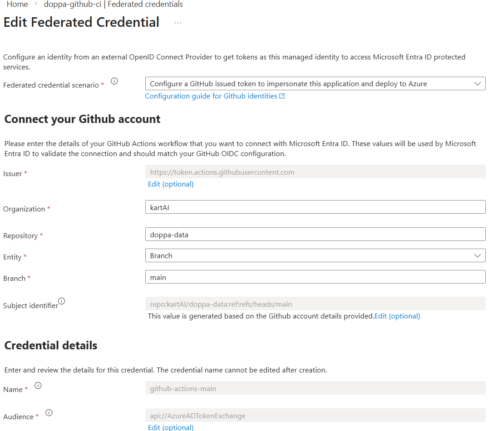
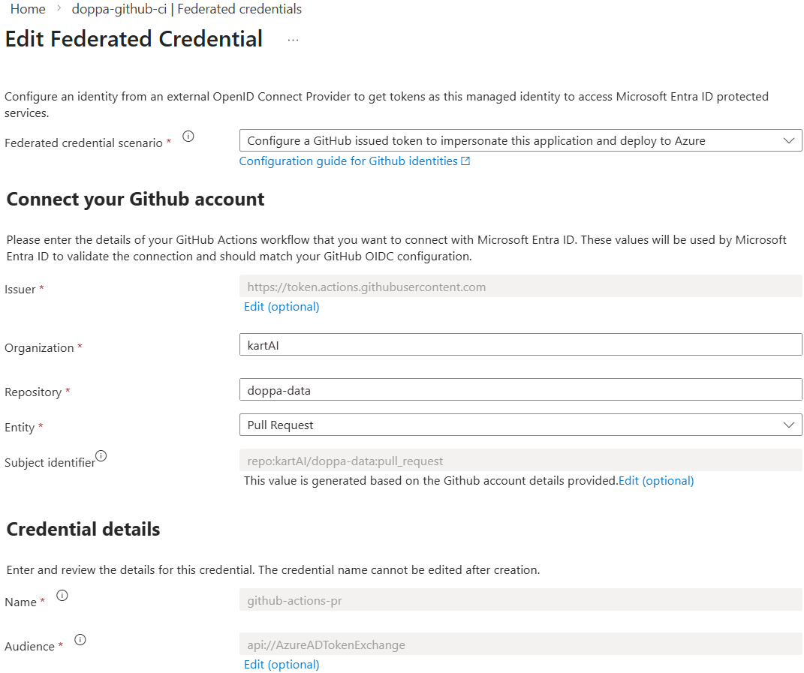

# doppa: A Framework for Comparing Traditional & CNG Queries

doppa is a reproducible benchmarking framework for evaluating traditional geospatial query stacks
(PostGIS, shapefiles) against cloud-native geospatial (CNG) alternatives (DuckDB over GeoParquet in
blob storage, PMTiles/MVT vector tiles, and Apache Sedona on Databricks) across a range of real-world
spatial query patterns: database scans, bounding-box filtering at varying result-set sizes, vector
tile fetching, spatial aggregation over grids, attribute + spatial compound filters, ordered range
queries, point-in-polygon lookups, and national-scale spatial joins.

Each query is packaged as an independent container image, executed on Azure Container Instances via
an orchestrator, and produces cost and runtime metrics written back to blob storage for downstream
analysis. The framework is designed to make the trade-offs between traditional and CNG approaches
measurable and reproducible on identical datasets and hardware.

<div align="center">

[](https://github.com/kartAI/doppa-data/actions/workflows/push-containers-to-acr.yml) [](https://github.com/kartAI/doppa-data/actions/workflows/publish-api.yml) [](https://github.com/kartAI/doppa-data/actions/workflows/setup-benchmarking-framework.yml) [](https://github.com/kartAI/doppa-data/actions/workflows/run-benchmarks.yml)

</div>

## Table of contents

- [Benchmarking framework](#benchmarking-framework)
    - [Measurement loop](#measurement-loop)
    - [Engines under test](#engines-under-test)
    - [Databricks cluster lifecycle](#databricks-cluster-lifecycle)
    - [Pairing and randomization](#pairing-and-randomization)
- [Research gaps addressed](#research-gaps-addressed)
- [Setup](#setup)
    - [Azure Resources](#azure-resources)
        - [Resource group](#resource-group)
        - [Blob storage](#blob-storage)
        - [User-Assigned Managed Identity (UAMI)](#user-assigned-managed-identity-uami)
        - [Container registry](#container-registry)
        - [PostgreSQL database](#postgresql-database)
        - [Web app for containers](#web-app-for-containers)
        - [Databricks](#databricks)
    - [GitHub Actions](#github-actions)
    - [Local development](#local-development)
- [Dataset layout](#dataset-layout)
    - [Sizes and synthesis](#sizes-and-synthesis)
    - [Postgres tables](#postgres-tables)
    - [Setup runtime and test mode](#setup-runtime-and-test-mode)
- [References](#references)

## Benchmarking framework

The framework runs every benchmark under a uniform measurement protocol so that single-node and distributed engines can
be compared on the same axes (elapsed time, network bytes, cost). Each benchmark lives as an independent container
image, orchestrated by `main.py`, dispatched by `benchmark_runner.py`, and implemented in `src/presentation/entrypoints/`.

### Measurement loop

Every entrypoint is wrapped by the `@monitor` decorator in `src/application/common/monitor.py`. One execution proceeds
as:

1. **Warmup iterations** run `Config.BENCHMARK_WARMUP_ITERATIONS` times (default 5). Results are discarded. Warmup
   primes the OS page cache, DuckDB and PostgreSQL connection state, and any JIT-compiled hot paths in the engine.
2. **Timed iterations** run a per-query count taken from the `BenchmarkIteration` enum (for example 1000 for `DB_SCAN`,
   7 for `NATIONAL_SCALE_SPATIAL_JOIN`). Each iteration records:
    - wall-clock elapsed time (`time.perf_counter`),
    - process CPU user and system seconds (`psutil.Process.cpu_times`),
    - container network bytes sent and received (`psutil.net_io_counters`),
    - result cardinality.
3. **Cost analytics** are computed once per benchmark over the wall-clock window that covers the timed iterations only.
   Warmup is excluded. Pricing constants live in `src/infra/infrastructure/services/azure_pricing_service.py`, pinned
   to 2026 Norway East rates with source URLs and update notes.

Per-iteration samples and per-benchmark cost rows are written as Parquet to the `benchmarks` blob container in a
hive-partitioned layout, so downstream analysis can read full distributions rather than point averages.

### Engines under test

| Engine                  | Layer                            | Storage                                                                                |
|-------------------------|----------------------------------|----------------------------------------------------------------------------------------|
| DuckDB                  | Single-node, in-container        | GeoParquet over Azure Blob Storage (`read_parquet('az://...')`)                        |
| PostGIS                 | Single-node, managed service     | Azure Database for PostgreSQL Flexible Server                                          |
| GeoPandas + Shapefile   | Single-node, local-disk baseline | Shapefile pre-downloaded to the container before the timed scope                       |
| Apache Sedona           | Distributed                      | Azure Databricks, 2 / 4 / 8 `Standard_D4s_v3` workers, reading GeoParquet via ABFS     |
| PMTiles                 | Cloud-native vector tiles        | PMTiles archive in blob storage, accessed via HTTP range reads                         |
| WMS-style vector tiles  | Traditional vector tiles         | `doppa-vmt` web app for containers, tiles assembled on demand                          |

DuckDB and PostGIS each run inside an Azure Container Instance with 3 vCPU and 8 GB RAM, so CPU and memory baselines
match between the single-node engines.

### Databricks cluster lifecycle

The Databricks national-scale spatial join uses a deliberately warm cluster, mirroring the warmup discipline applied to
the single-node engines:

1. `DatabricksService.create_cluster` provisions one cluster, installs the Sedona Maven coordinate and the
   `apache-sedona` and `geopandas` PyPI packages via the libraries API, and waits for `RUNNING`. This happens before
   `@monitor`'s timing window opens.
2. The `@monitor` warmup and timed iterations all submit notebook runs against the same `existing_cluster_id`.
   Subsequent iterations see warm executors, primed Catalyst plans, and cached broadcast variables.
3. `DatabricksService.terminate_cluster` runs in a `finally` block after the timed iterations complete, so the cluster
   is torn down even if the benchmark raises.

Cluster provisioning and termination are deliberately outside the cost window. The thesis question is the cost of
running queries on an optimally warm engine, not the cost of cold-starting one per query. Provisioning is a one-time
setup cost in any production deployment, amortized over many queries rather than billed per query.

The notebook (`src/presentation/databricks/national_scale_spatial_join.py`) registers a `SparkListener` that aggregates
per-stage metrics — executor input bytes, shuffle read and write bytes, stage durations, executor run time — and returns
them alongside the query result via `dbutils.notebook.exit`. These phase metrics are persisted on the per-iteration
sample so the distributed runtime can be decomposed into read, shuffle, and driver collection time.

### Pairing and randomization

`main.py` shuffles the experiment list with `random.Random(benchmark_run)` before launching containers. Experiments
that compare directly (for example `db-scan-blob-storage` and `db-scan-postgis`) declare each other under
`related_script_ids` in `benchmarks.yml` and are launched concurrently via a `ThreadPoolExecutor`. Running a paired
benchmark in the same wall-clock window controls for short-term cloud variability between the two engines being
compared.

## Research gaps addressed

The framework is built around the three gaps identified in chapter 3 of the accompanying thesis.

**Network transfer accounting.** Most spatial benchmarks treat network communication as a system-design concern (Tang
et al. 2020) rather than a reported experimental metric. Cloud delivery cost, however, is partly driven by transferred
bytes (Folkerts et al. 2013). doppa records `network_bytes_sent` and `network_bytes_received` per iteration as primary
outputs alongside elapsed time. The Databricks notebook additionally reports executor input bytes and shuffle read /
write bytes via the `SparkListener`. PostgreSQL ingress and egress are read from Azure Monitor. `AzureCostService`
derives `network_cost` directly from these counters when it computes per-benchmark cost rows, so the link from
format internals to client-observed cost is measured end to end.

**Cloud-native vector formats vs. traditional formats on cloud storage.** Empirical comparisons in the literature
(Holmes 2023; Flatgeobuf 2024) measure write times and file sizes on local disk and do not place cloud-native and
traditional formats side by side on cloud storage. doppa benchmarks GeoParquet over Azure Blob Storage (via DuckDB)
against PostGIS on Azure Database for PostgreSQL, and PMTiles against WMS-style vector tiles, across the full catalog
of query patterns: full scans, bounding-box filters at three result-set sizes (neighborhood, municipality, county),
spatial aggregation over a grid, attribute-and-spatial compound filters, ordered range queries, point-in-polygon
lookups, and a national-scale spatial join. The local-Shapefile entrypoints sit on the side as a laptop-workflow
reference, with the Shapefile downloaded ahead of the timed scope to emulate that workflow rather than to bench the
format on cloud storage.

**Single-node vs. distributed engines on the same vector workload.** Prior comparisons restrict themselves either to
Spark-based systems (Pandey et al. 2018) or to single-node engines (Jackpine; Ray et al. 2011). doppa runs the same
national-scale spatial join through DuckDB, PostGIS, and Apache Sedona on Databricks at three cluster sizes (2, 4, and
8 workers), against the same `counties.parquet` boundary set and the same `BENCHMARK_DOPPA_DATA_RELEASE` building
dataset. With the cluster-reuse measurement window in place, every engine reports elapsed time and cost over the same
span — warmup outside the window, timed iterations on a warm engine — so the comparison is symmetric. Distributed-only
metrics (shuffle bytes, stage durations, driver collection time) are recorded as additional columns rather than as
replacements for the cross-engine ones.

The methodological gap noted in the thesis — the absence of effect-size reporting and uncertainty quantification in
spatial benchmarks — is handled in downstream analysis. The framework's contribution is to persist every iteration's
raw sample so distributions, Wilcoxon rank-sum tests, bootstrapped confidence intervals, and Vargha–Delaney Â12 effect
sizes can be computed without re-running the benchmark.

## Setup

### Azure Resources

This project utilizes several Azure resources. Some are created and deleted during runtime, whilst others have to be
created manually. This section will give a brief walkthrough on the resources that have to be configured and how to do
so.

> [!NOTE]
> To ensure fair benchmarks set up all resources in Norway East

#### Resource group

Start by creating a resource group named `doppa`. Ensure that you can configure Kubernetes and Databricks with your
current subscription and roles.

#### Blob storage

Blob storage is an essential part of this benchmarking framework. Everything from benchmarking results to the actual
datasets are stored here. Create a storage account named `doppabs`. Under *Data protection* disable everything.
All other settings can be left as default.

> [!IMPORTANT]
> Disabling all data protection options (soft delete for blobs and containers) is required. If these features are
> enabled the Databricks ABFS driver will fail with a 409 error when reading data via the `dfs.core.windows.net`
> endpoint.

There is no need to create the containers
as these are created during runtime. Each container is created with the `Container` access level. If you wish to make
this stricter make the following changes in the `ensure_container` function in [
`BlobStorageService`](./src/infra/infrastructure/services/blob_storage_service.py).

```python
# Public container access
self.__blob_storage_context.create_container(container_name.value, public_access=PublicAccess.CONTAINER)  
```

```python
# Private container access
self.__blob_storage_context.create_container(container_name.value, public_access=PublicAccess.BLOB)
```

#### User-Assigned Managed Identity (UAMI)

To provide the correct access to Azure resources when running the script from GitHub Actions a UAMI has to be
configured. The Actions will sign in to Azure and execute the scripts using the UAMI. Create a UAMI named
`doppa-uami` and navigate to the *Federated credentials* setting. Create two federated credentials with the
following setup:

<div style="display:flex; justify-content:center; align-items:flex-start; gap:20px;">
  
  
</div>

Change the fields according to your setup.

The next step is to give the UAMI a `Contributor` in the resource group. Navigate to the *Azure role assignments*
setting and press *Add role assignment*. Select the scope `Resource group` and then the resource group `doppa`. Pick the
role `Contributor` and press *Save*.

To view the `AZURE_UAMI_RESOURCE_ID` (needed for later) run the following command:

```powershell
az identity show -g doppa -n doppa-uami --query id -o tsv
```

#### Container registry

Create a container registry named `doppaacr`. The Docker images will be saved here. To ensure that the Actions are able
to pull the images give the UAMI created in the last step a `AcrPull` and `AcrPush` role. In the `doppaacr` resource
navigate to

*Access control (IAM)* and press *Add* > *Add role assignment*. Select the role `AcrPull` and continue. On the next
screen select *Managed identity* under *Assign access to*, and select the `doppa-uami` UAMI under *Members*.
Navigate to the last step and press *Create*.

Repeat the same steps for the `AcrPush` role.

#### PostgreSQL database

Create
an [Azure database for PostgreSQL](https://portal.azure.com/#view/Microsoft_Azure_Marketplace/GalleryItemDetailsBladeNopdl/id/Microsoft.PostgreSQLServer/selectionMode~/false/resourceGroupId//resourceGroupLocation//dontDiscardJourney~/false/selectedMenuId/home/launchingContext~/%7B%22galleryItemId%22%3A%22Microsoft.PostgreSQLServer%22%2C%22source%22%3A%5B%22GalleryFeaturedMenuItemPart%22%2C%22VirtualizedTileDetails%22%5D%2C%22menuItemId%22%3A%22home%22%2C%22subMenuItemId%22%3A%22Search%20results%22%2C%22telemetryId%22%3A%22a28a8a60-8a59-43fd-8def-fc6cba1ca11f%22%7D/searchTelemetryId/0a3db32e-00e8-4ba8-b921-45bc0a7a5a28)
with the following configuration:

Under *Basics*:

- Server name: `doppa-db`
- Region: `Norway East`
- Workload type: `Production`
- Compute + Storage: Disable `Geo-Redundancy`
    - Cluster: Set *Cluster options* to `Server`
    - Compute: Set *Compute tier* to `Burstable` and set *Compute size* to `Standard_B2ms`
    - Storage: Set *Storage type* to `Premium SSD`, *Storage size* to `128 GiB` and *Performance tier* to `P10`
    - Business critical: Set *Zonal resiliency* to `Disabled`
- Authentication method: `PostgreSQL authentication only`

Under *Networking*:

- Firewall rules: Check the box *Allow public access from any Azure service within Azure to this server*.
- Add current IP address to Firewall rules

Navigate to *Review and create* and create the resource.

After the database has been deployed navigate to the setting *Server parameters* and search for `azure.extensions`. In
the drop-down menu select `POSTGIS`. This enables the script to install PostGIS automatically during run-time. Under the
same setting change the following:

- `shared_buffers`: `2097152`
- `effective_cache_size`: `6291456`
- `work_mem`: `65536`

#### Web app for containers

Create
a [web app for containers](https://portal.azure.com/#view/Microsoft_Azure_Marketplace/GalleryItemDetailsBladeNopdl/id/Microsoft.AppSvcLinux/selectionMode~/false/resourceGroupId//resourceGroupLocation//dontDiscardJourney~/false/selectedMenuId/home/launchingContext~/%7B%22galleryItemId%22%3A%22Microsoft.AppSvcLinux%22%2C%22source%22%3A%5B%22GalleryFeaturedMenuItemPart%22%2C%22VirtualizedTileDetails%22%5D%2C%22menuItemId%22%3A%22home%22%2C%22subMenuItemId%22%3A%22Search%20results%22%2C%22telemetryId%22%3A%22135c4e97-6a92-446e-aa0a-3f2201ddfdb1%22%7D/searchTelemetryId/c154ee0a-06d6-49e4-a17f-3820937e6335)
The process is the same for each of the following API servers:

- `doppa-vmt`

Under *Basics*:

- Resource group: `doppa`
- Name: `<name-from-list-above>`
- Publish: `Container`
- Operating system: `Linux`
- Pricing plan: `Premium V4 P0V4`

Under *Container*:

- Image source: `Azure Container Registry`
- Registry: `doppaacr`
- Authentication: `Managed identity`
- Identity: `doppa-uami`
- Image: `<select the image that matches with the name>`
- Tag: `latest`
- Startup command `uvicorn src.presentation.endpoints.<API server script>:app --host 0.0.0.0 --port 8000`

Navigate to *Review + create* and create the resource. Repeat this process for each name in the list.

#### Databricks

The national-scale spatial join benchmarks run on Azure Databricks using Apache Sedona. A separate Databricks
workspace is required.

> [!NOTE]
> Norway East often has insufficient `Standard_D4s_v3` quota for multi-node clusters. Create the workspace in
> **Sweden Central** instead. Cross-region data access (blob storage in Norway East, compute in Sweden Central)
> adds minor latency but does not affect benchmark validity.

##### 1. Request vCPU quota

The benchmarks run clusters with 2, 4, and 8 worker nodes. Each `Standard_D4s_v3` node uses 4 vCPUs, so the
8-node cluster requires 32 vCPUs (plus the driver). The default quota in most regions is 10 vCPUs.

To request a quota increase:

1. Navigate to the [Azure Portal](https://portal.azure.com) → **Subscriptions** → your subscription →
   **Settings** → **Usage + quotas**
2. Filter by region (e.g. Sweden Central) and search for `Standard DSv3 Family vCPUs`
3. Click the pencil icon and request at least **40 vCPUs**
4. Provide a justification (e.g. "Running distributed Spark benchmarks") and submit

Quota increases for small VM families are typically approved automatically within minutes.

##### 2. Create the workspace

1. In the Azure Portal create a new **Azure Databricks** resource
2. Under *Basics*:
   - Resource group: `doppa`
   - Workspace name: `doppa-databricks`
   - Region: **Sweden Central** (or another region with sufficient quota)
   - Pricing tier: `Premium`
3. Leave all other settings as default and press *Review + create*

##### 3. Generate an access token

1. Open the Databricks workspace
2. Navigate to your user icon (top right) → **Settings** → **Developer** → **Access tokens**
3. Click *Generate new token*, give it a name and a suitable expiry, and copy the token value

##### 4. Environment variables

Add the following to your `.env` file:

```dotenv
DATABRICKS_HOST=https://<workspace-id>.azuredatabricks.net
DATABRICKS_TOKEN=<personal-access-token>
AZURE_BLOB_STORAGE_ACCOUNT_KEY=<storage-account-access-key>
```

- `DATABRICKS_HOST`: the full URL of your workspace (visible in the browser address bar after opening the workspace)
- `DATABRICKS_TOKEN`: the token generated in the previous step
- `AZURE_BLOB_STORAGE_ACCOUNT_KEY`: found in Azure Portal → Storage account `doppabs` → **Security + networking** → **Access keys** → copy either `key1` or `key2`

The notebook script is automatically uploaded to the Databricks workspace at run time. No manual upload is required.

##### 5. Upload county boundaries

The spatial join requires Norwegian county polygon data in the `metadata` blob storage container.
Upload `counties.parquet` to the `metadata` container in the `doppabs` storage account before running
the Databricks benchmarks. This can be done via the Azure Portal Storage Browser or the Azure CLI:

```bash
az storage blob upload \
  --account-name doppabs \
  --container-name metadata \
  --name counties.parquet \
  --file <path-to-counties.parquet>
```

### GitHub Actions

In your repository navigate to *Secrets and variables* under *Settings*. Add the following **secrets**:

- `AZURE_UAMI_RESOURCE_ID`
- `AZURE_BLOB_STORAGE_CONNECTION_STRING`
- `AZURE_BLOB_STORAGE_ACCOUNT_KEY`
- `POSTGRES_USERNAME`
- `POSTGRES_PASSWORD`
- `DATABRICKS_HOST`
- `DATABRICKS_TOKEN`

and add the following **variables**:

- `ACR_NAME`
- `ACR_LOGIN_SERVER`
- `AZURE_BLOB_STORAGE_BENCHMARK_CONTAINER`
- `AZURE_BLOB_STORAGE_METADATA_CONTAINER`
- `AZURE_CLIENT_ID`
- `AZURE_RESOURCE_GROUP`
- `AZURE_SUBSCRIPTION_ID`
- `AZURE_TENANT_ID`
- `POSTGRES_SERVER_NAME`

These values can be found under the Azure resources previously created. The workflows should now work!

### Local development

> [!NOTE]
> This does not run fully locally, so ensure that all the Azure resources have been configured

Clone the repository from [GitHub](https://github.com/kartAI/doppa-data) and navigate to the project root.

```powershell
git clone https://github.com/kartAI/doppa-data.git
cd doppa-data
```

Create a virtual environment and install the dependencies in the [requirements](./requirements.txt)-file.

```powershell
python -m venv venv                 # Create virtual environment
./venv/Scripts/activate             # Activate venv
pip install -r requirements.txt     # Install dependencies
```

Add the following `.env` file to the project root directory. Swap out the values enclosed by `<>` with the actual
secrets. The containers `dev-benchmarks` and `dev-metadata` ensure that results from the test runs do not disrupt
results from actual runs.

```dotenv
AZURE_SUBSCRIPTION_ID=<azure-subscription-id>
AZURE_UAMI_RESOURCE_ID=<azure-user-assigned-managed-identity-resource-id>

AZURE_BLOB_STORAGE_CONNECTION_STRING=<azure-blob-storage-connection-string>
AZURE_BLOB_STORAGE_ACCOUNT_KEY=<azure-blob-storage-account-key>
AZURE_BLOB_STORAGE_BENCHMARK_CONTAINER=dev-benchmarks
AZURE_BLOB_STORAGE_METADATA_CONTAINER=dev-metadata

ACR_LOGIN_SERVER=<azure-container-registry-login-server>

POSTGRES_SERVER_NAME=<postgres-server-name>
POSTGRES_USERNAME=<postgres-username>
POSTGRES_PASSWORD=<postgres-password>

DATABRICKS_HOST=https://<workspace-id>.azuredatabricks.net
DATABRICKS_TOKEN=<personal-access-token>
```

To run the entire script simply run `python main.py` or `python -m main` and to run a single benchmark run
`python benchmark_runner.py --script-id <script-id> --benchmark-run <int >= 1> --run-id <run-id>`. See the table
below for more information about
`--script-id` and `--run-id`.

| Flag              | Format / Pattern             | Meaning                                                                                                                                                       |
|-------------------|------------------------------|---------------------------------------------------------------------------------------------------------------------------------------------------------------|
| `--script-id`     | `<query-type>-<service>`     | Identifies which query is being executed. `<query-type>` examples: `db-scan`, `bbox-filtering`. `<service>` examples: `blob-storage`, `postgis`.              |
| `--benchmark-run` | `int`                        | Identifier that tells which iteration of the benchmarking is currently running. This is to run the benchmarks on multiple container instances.                |
| `--run-id`        | `<current-date>-<random-id>` | Identifies a benchmark run. Shared across all queries in a single orchestrated run. Date format: `yyyy-mm-dd`; random ID: 6-character uppercase alphanumeric. |

## Dataset layout

Benchmark datasets are stored in the `data` blob container partitioned by release, size, theme, and region:

```
az://data/release/{release}/size={small|medium|large}/theme=buildings/region={region}/part_XXXXX.parquet
```

The `size=` segment is required for all conflated and synthesized building data. Raw OSM/FKB partitions (under
the `raw` container) do not carry the `size=` segment.

Files are written as GeoParquet 1.1.0 with:

- `geometry_encoding="WKB"`
- `schema_version="1.1.0"`
- `write_covering_bbox=True` (adds a `bbox` struct column with `xmin`, `ymin`, `xmax`, `ymax`)
- `row_group_size=100_000`
- Rows sorted by `partition_key` (geohash precision 3 over the LAEA Europe centroid)

### Sizes and synthesis

| Size     | Target row count | Source                                                                                                  |
|----------|------------------|---------------------------------------------------------------------------------------------------------|
| `small`  | ~5M              | Conflation of OSM + FKB. Written directly by `TestDatasetService` during setup.                         |
| `medium` | ~40M             | `DatasetSynthesisService`: 7 clones per source polygon (translate + rotate + jitter, drop invalid).     |
| `large`  | ~100M            | `DatasetSynthesisService`: 19 clones per source polygon.                                                |

Per-polygon clone counts are exposed on the enum (`DatasetSize.MEDIUM.clones_per_polygon == 7`). Synthetic clones
carry the same schema as originals, with non-geometry attributes (e.g. `building_type`, `building_id`, `source`)
left `NULL`. The `partition_key` is recomputed for clones from the new centroid.

Attribute filters (e.g. `WHERE source = 'osm'` in the compound-filter benchmark) match only the ~5M original rows
on `size=medium` / `size=large`. This is acceptable for scaling benchmarks.

### Postgres tables

`setup_benchmarking_framework` seeds three Postgres tables, one per size:

- `buildings_small` (~5M rows)
- `buildings_medium` (~40M rows)
- `buildings_large` (~100M rows)

Each has a matching GIST spatial index named `buildings_{size}_geometry_idx`. The seed streams rows from blob
storage via DuckDB `fetch_df_chunk` to avoid materializing the full dataset in memory.

### Setup runtime and test mode

A full `setup_benchmarking_framework` run on real Azure resources is dominated by Postgres seeding of
`buildings_large` (multi-hour wall on the B2ms tier). Approximate per-step runtimes for the full Norway dataset:

| Step | Description                              | Approximate runtime |
|------|------------------------------------------|---------------------|
| 1    | `test_dataset_service.run_pipeline()`    | 25–55 min           |
| 2    | Synthesize medium (~40M rows)            | 25–40 min           |
| 3    | Synthesize large (~100M rows)            | 50–90 min           |
| 4    | Postgres seed (small + medium + large)   | 3.5–7 hr            |
| 5    | Shapefile copy                           | 3–5 min             |

For faster iteration during development, set `SETUP_COUNTY_LIMIT=N` in `.env`. When set, `TestDatasetService`
and `DatasetSynthesisService` slice their per-county loops to the first `N` Norwegian counties, and the Postgres
seed naturally picks up only those counties' parquet partitions. A run with `SETUP_COUNTY_LIMIT=1` (Oslo only)
completes end-to-end in ~10 minutes.

```dotenv
SETUP_COUNTY_LIMIT=1
```

Leave `SETUP_COUNTY_LIMIT` unset (or remove it) for the full Norway run.

## References

Flatgeobuf. (2024). *FlatGeobuf performance benchmarks (geozero-bench)*. Retrieved from
<https://flatgeobuf.org/>

Folkerts, E., Alexandrov, A., Sachs, K., Iosup, A., Markl, V., & Tosun, C. (2013). Benchmarking in the cloud: What it
should, can, and cannot be. In *Selected topics in performance evaluation and benchmarking (TPCTC 2012)* (Vol. 7755,
pp. 173–188). Springer. <https://doi.org/10.1007/978-3-642-36727-4_12>

Holmes, C. (2023, August). *Performance explorations of GeoParquet (and DuckDB)*. Cloud-Native Geospatial Foundation.
<https://cloudnativegeo.org/blog/2023/08/performance-explorations-of-geoparquet-and-duckdb/>

Pandey, V., Kipf, A., Neumann, T., & Kemper, A. (2018). How good are modern spatial analytics systems? *Proceedings of
the VLDB Endowment*, 11(11), 1661–1673. <https://doi.org/10.14778/3236187.3236213>

Ray, S., Simion, B., & Demke Brown, A. (2011). Jackpine: A benchmark to evaluate spatial database performance. *2011
IEEE 27th International Conference on Data Engineering (ICDE)*, 1139–1150.
<https://doi.org/10.1109/ICDE.2011.5767929>

Tang, M., Yu, Y., Malluhi, Q. M., Ouzzani, M., & Aref, W. G. (2020). LocationSpark: In-memory distributed spatial query
processing and optimization. *Frontiers in Big Data*, 3. <https://doi.org/10.3389/fdata.2020.00030>

